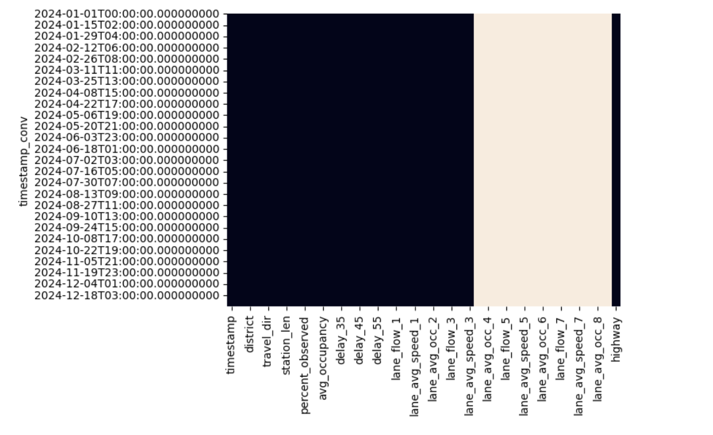

# Los Angeles Traffic Prediction

## Overview

This project is a full-stack machine learning application that forecasts traffic conditions given a Los Angeles highway station. It combines data processing, forecasting using Facebook Prophet, and visualization in an interactive Streamlit app. The backend is powered by a Flask API and containerized with Docker, enabling scalable deployment on platforms such as Google Cloud Run. The motivation for the project is to inform users about traffic conditions and levels of congestion. 

⸻

## Methodology 

### Data Source and Collection
The data is sourced from the [Caltrans Performance Measurement System (PeMS)](https://dot.ca.gov/programs/traffic-operations/mpr/pems-source), which contains historical data from almost forty thousand sensors along major California highways. For this project, I narrowed the scope to data from 2024 in Los Angeles County. I used Selenium to webscrape the .gz files from the PeMS system, as specified in the `downloadData.py` script. 

### Data Pipeline
    1. Use the `moveFiles.py` script to combine monthly CSV data into one CSV (size 5.5 GB)
	2.	Preprocessing with Dask: Load raw CSV data, change column names and filter out rows with more than 60% missing values in the feature `total_flow`. Further reduced the dataset by a factor of 10, pulling out every 10th station, to save on computation and memory requirements. Save as a CSV which can be loaded in by Flask. 
	3. Convert to pandas: After user enters a station id, filter the Dask dataframe by station id to about ~8k rows and switch to pandas for modeling. 

### Exploratory Data Analysis
Some steps I took to analyze the data included:
- Using Dask's `compute` funcion to specifically compute attributes like dataset dimensions and feature data types
- Initially filtered the dataset down to just one station ID to make EDA easier 
- Looked at null values in the dataset and created heatmaps to visualize patterns of null values  

- Looked at different features from the PeMS dataset with the filtered down dataset to get a preliminary understanding of daily and monthly trends 

### Backend
The backend is a Flask API which is deployed on Google Cloud Run. The endpoint of the API is [here](https://traffic-prediction-418-26302743692.europe-west1.run.app). The Flask API has the following routes: 
- /: confirm that the backend is running properly
- /forecast-traffic: this route takes in user inputs, builds a Prophet model, and creates forecasts
- /get-prophet-image: this route gets the plots created from the /forecast-traffic route

The Flask API utilizes functions defined in the `model.py` file, which has the following functions: 
- `load_data`: Uses Dask, a Python library, to read in some preprocessed data from a large CSV file and converts the time column to datetime format, which Prophet requires. 
- `filter_dataset_by_station`: Filters the data by station ID and converts the Dask dataframe to a Pandas dataframe to pass in to the Prophet model. 
- `build_prophet_model`: Pulls out the time and average speed features to fit the Prophet model.
- `make_predictions`: Takes in the fitted Prophet model, number of periods, and frequency (h or d) to make a forecast and generate plots for traffic trends. 

	3.	Prophet Forecasting:
	•	Convert columns to Prophet’s expected schema (ds, y)
	•	Fit and forecast future speed values
	•	Save interactive forecast component plots (trend, weekly, etc.)

### Frontend
The user application is deployed with Streamlit and hosted on Streamlit Community Cloud. I used the library Folium to create a map of PeMS stations that users can interact with. I also used Plotly to visualize traffic trends based on the user's inputted station, number of periods, and frequency (hours or days).

	•	Forecast traffic speed using the Prophet model
	•	Interactive map to select traffic stations
	•	Hourly/daily predictions up to user-defined periods
	•	Visualize forecast components (trend, weekly, yearly seasonality)
	•	Scalable Flask backend serving forecasts as a RESTful API
	•	Streamlit frontend for interactive UX

⸻

## Folder Structure

project-root/
│
├── backend/
│   ├── server.py               # Flask API server
│   ├── model.py                # Forecasting logic with Prophet
│   ├── requirements.txt        # Backend dependencies
│   ├── Dockerfile              # Docker config for backend
│   └── merged_hour_preprocessed.csv  # Raw traffic dataset (~5GB)
│
├── frontend/
│   └── streamlit_app.py        # Streamlit frontend interface
│
├── docker-compose.yml         # Optional: compose backend + frontend
└── README.md

⸻

Technologies Used

Data & Forecasting
	•	Dask: Scalable preprocessing for large CSV file (5GB+)
	•	Pandas: Filtering and reshaping
	•	Prophet: Forecasting average traffic speed

Backend
	•	Flask: REST API for model inference
	•	Docker: Containerize and deploy Flask app
	•	Google Cloud Run: Serverless deployment platform

⸻

Data Pipeline
	1.	Preprocessing with Dask: Load and filter raw CSV data (station, timestamp, speed)
	2.	Convert to pandas: Once filtered (~8K rows), switch to pandas for modeling
	3.	Prophet Forecasting:
	•	Convert columns to Prophet’s expected schema (ds, y)
	•	Fit and forecast future speed values
	•	Save interactive forecast component plots (trend, weekly, etc.)

⸻

Flask API Endpoints

/forecast-traffic [POST]

Description: Receives user input (station_id, freq, periods) and returns success message after generating forecast

Request JSON:

{
  "station_id": "715915",
  "freq": "H",
  "periods": 24
}

Response:

{ "message": "Success" }

/get-prophet-image [GET]

Description: Serves the latest Prophet forecast component plot as a PNG

⸻

Streamlit Frontend
	•	Interactive map of California with station markers
	•	On click: stores selected station in session state
	•	Button triggers API call to Flask backend
	•	Receives forecast and displays:
	•	Forecast summary
	•	Prophet component plot with zoom

⸻

Deployment Notes
	•	Docker image is ~2GB due to system dependencies for Prophet/Stan
	•	Uses python:3.12-slim base image
	•	System dependencies include: build-essential, gcc, g++, make, libpython3-dev
	•	Backend deployed via Docker and Google Cloud Run
	•	Forecast image is saved to disk and streamed to Streamlit via HTTP

⸻

Future Work
	•	Optimize memory usage during filtering (especially in Docker)
	•	Use cloud storage for large dataset (rather than bundling in image)
	•	Replace static PNG with Plotly JSON payload to avoid image saving
	•	Explore alternative models (XGBoost, LSTM) for traffic forecasting
	•	Container slimming: explore alpine images or multi-stage builds

⸻

Setup Instructions

Local Development

cd backend
python3 -m venv venv
source venv/bin/activate
pip install -r requirements.txt
python server.py

In a separate terminal:

cd frontend
streamlit run streamlit_app.py

Docker Build & Deploy

docker build -t traffic-backend .
docker run -p 5001:5001 traffic-backend

To redeploy on Google Cloud Run:
	1.	Push updated Docker image to DockerHub
	2.	Redeploy via Cloud Run UI or CLI

⸻

Acknowledgments
	•	Facebook Prophet team for robust forecasting library
	•	Caltrans for PeMS traffic data
	•	Streamlit community for open source interactivity tools