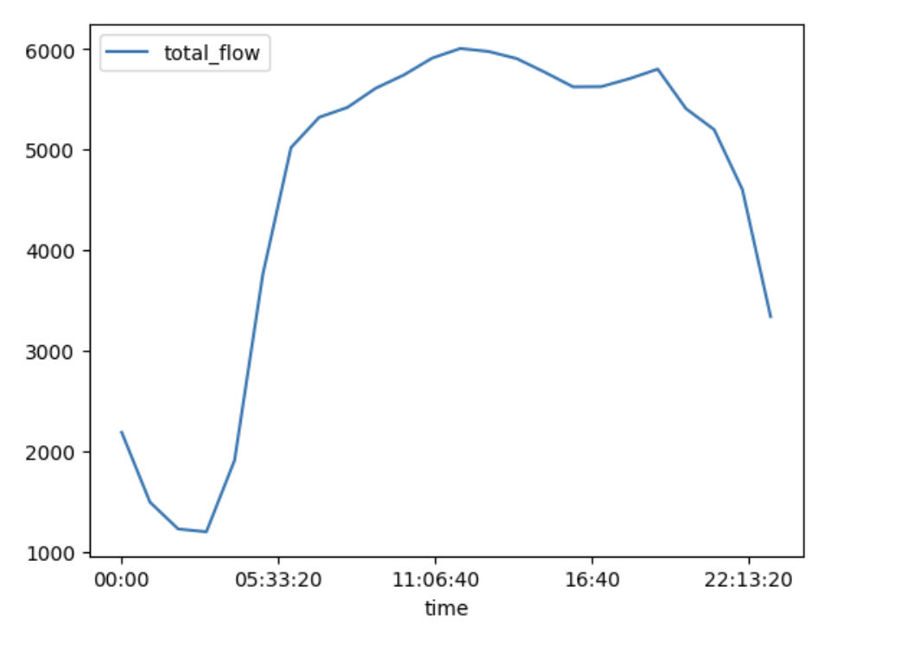
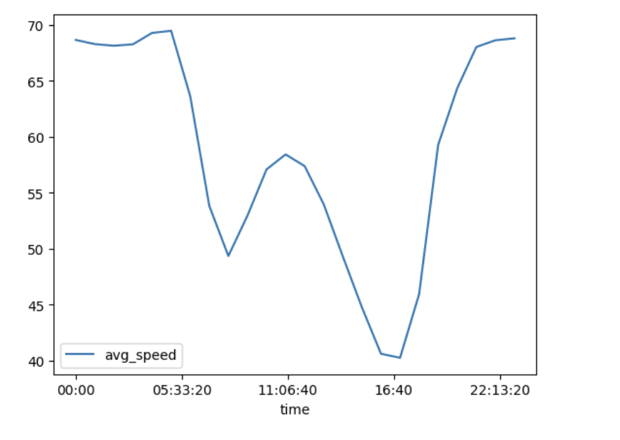
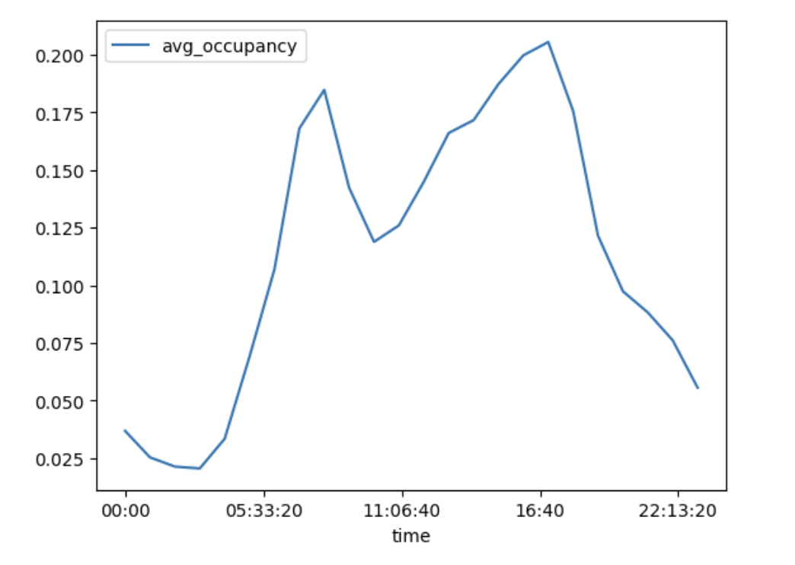

# Los Angeles Traffic Forecasting

## Contents of this README
1. [Overview](#overview)
2. [Methodology](#methodology)
	- [Data Source and Collection](#data-source-and-collection)
	- [Data Pipeline](#data-pipeline)
	- [Exploratory Data Analysis](#exploratory-data-analysis)
	- [Backend](#backend)
	- [Frontend](#frontend)
3. [Folder Structure](#folder-structure)
4. [Future Work](#future-work)
5. [Setup Instructions](#setup-instructions)

## Overview

This project is a full-stack machine learning application that forecasts traffic conditions given a Los Angeles highway station. It combines web scraping, data processing, forecasting using NeuralProphet, and visualization in an interactive Streamlit app. The backend is powered by a Flask API and containerized with Docker, enabling scalable deployment on platforms such as Google Cloud Run. The motivation for the project is to inform general users, urban planners, and city officials about traffic conditions and levels of congestion. 

My interest in the project stems from my time working at the UC San Diego library, where I worked with a lot of datasets collected by the state or federal government, such as Census data. I'm especially interested in geographic data and visualizing data based on physical location of where the data was collected. 

My application can be accessed [HERE](https://los-angeles-traffic-prediction.streamlit.app/). 

## Methodology 

### Data Source and Collection
The data is sourced from the [Caltrans Performance Measurement System (PeMS)](https://dot.ca.gov/programs/traffic-operations/mpr/pems-source), which contains historical data from almost forty thousand sensors along major California highways. For this project, I narrowed the scope to data from 2024 in Los Angeles County, or Caltrans District 7. I used Selenium to automatically download the .gz files provided by the PeMS system, as specified in the `downloadData.py` script. 

### Data Pipeline
1. Pulling CSV files: I pulled the Station Hour files from PeMS, where each file represented one month of data. Each file had sensor data from one hour of monitoring, including information like average speed and total vehicle flow. I used the `moveFiles.py` script to combine monthly CSV data into one CSV (size 5.5 GB)
2. Preprocessing with Dask: I used the Python library Dask due to the volume of data and to speed up computation. I processed the dataframe by changing the column names and filtering out rows with more than 60% missing values in the feature `total_flow`. I then further reduced the dataset by a factor of 10, pulling out every 10th station, to save on computation and memory requirements. Then, I saved the preprocessed data as a CSV which is loaded in by Flask. 
3. Convert to pandas: After the user enters a station id, I filter the Dask dataframe by station id to about ~8k rows and switch to pandas for easier exploratory data analysis and modeling. 

### Exploratory Data Analysis
Some steps I took to explore the data included:
- Using Dask's `compute` funcion to specifically compute attributes like dataset dimensions and feature data types
- Looking at the data from just one station ID to make EDA easier and faster
- Analyzing null values in the dataset and creating heatmaps to visualize patterns of null values  

- Looked at different features from the PeMS dataset with the filtered down dataset to get a preliminary understanding of daily and monthly trends, such as total flow measured in vehicles per hour, average occupancy measured in density of vehicles, and average speed measured in mph. 

### Backend
The backend is a Flask API which is deployed on Google Cloud Run. The API is deployed at [this endpoint](https://traffic-prediction-418-26302743692.europe-west1.run.app). The Flask API defines the following routes: 
- `GET /`
  - Returns a welcome message.
  
- `GET /get-prophet-image`
  - Returns an image file for the generated plots from NeuralProphet, meant to be used after the POST request so that the frontend can retrieve and display the plot.
  - Example: `curl https://traffic-prediction-los-angeles-418-26302743692.europe-west1.run.app/get-prophet-image`
  - Response: returns an Image file

- `POST /forecast-traffic`
  - Accepts JSON body: `{"station_id": "776440", "freq": “h”, "periods": 24}`
  - Creates a plot for forecast based on the station provided and weekly/hourly trends for average speed and returns a success message

The Flask API utilizes functions defined in the `model.py` file, which has the following functions: 
- `load_data`: Uses Dask, a Python library, to read in some preprocessed data from a large CSV file and converts the time column to datetime format, which Prophet requires. 
- `filter_dataset_by_station`: Filters the data by station ID and converts the Dask dataframe to a Pandas dataframe to pass in to the Prophet model. 
- `build_prophet_model`: Pulls out the time and average speed features to fit the Prophet model.
- `make_predictions`: Takes in the fitted Prophet model, number of periods, and frequency (h or d) to make a forecast and generate plots for traffic trends. 

### Frontend
The user application is deployed with Streamlit and hosted on Streamlit Community Cloud. I used the library Folium to create a map of PeMS stations that users can interact with. I also used Plotly to visualize traffic trends based on the user's inputted station, number of periods, and frequency (hours or days). Once the user inputs what they want, the frontend will call the backend and display visualizations for the forecasted average speed, weekly average speed trends, and hourly average speed trends. 

## Folder Structure

<pre><code>.
PROJECT418/
├── backend/
│   ├── docker-compose.yml: configuration file to manage Docker application
│   ├── Dockerfile: defines Docker image
│   ├── requirements.txt: list of dependencies and packages for the backend
│   ├── model.py: defines functions to process data and build the NeuralProphet model
│   ├── np_parameters_plot.png: this plot is generated by the NeuralProphet model after predicting a forecast
│   └── server.py: defines the Flask API routes
├── frontend/
│   ├── app.py: sets up the Streamlit frontend and interactive components
│   ├── filtered_reduced_stations.txt: contains reduced list of PeMS stations that I'm considering in this application
│   ├── requirements.txt: list of dependencies and packages for the frontend
│   ├── station_metadata.txt: metadata about the PeMS stations used to display information on the frontend
├── notebooks/
│   ├── Final418DataProcessing.ipynb: notebook used for EDA and as a testing ground for building the NeuralProphet model
│   └── requirements.txt: list of dependencies and packages for running the notebook
├── .gitignore: files to not put on GitHub
├── downloadData.py: script to scrape data with Selenium from the PeMS system
└── moveFiles.py: script to organize the downloaded files and merge them into one CSV
</code></pre>

## Future Work
- Use the user inputs of number of periods and frequency and add in a graph to show forecasted trends in the future
- Optimize memory usage and data management plan to be able to use more historical data
- Find a way to not bundle the large dataset into the Docker container
- Allow user to add their commute to the frontend and predict average speed or total flow on the commute
- Explore more forecasting models like XGBoost

## Setup Instructions
To locally run the Flask API and Streamlit application, run the following commands:

<pre><code>
cd backend
python3 -m venv venv # creates the virtual environment
source venv/bin/activate
pip install -r requirements.txt # install dependencies
python server.py
</code></pre>

In a separate terminal:

<pre><code>
cd frontend
python3 -m venv venv
source venv/bin/activate
pip install -r requirements.txt
streamlit run streamlit_app.py
</code></pre>

My Docker image can be accessed on Dockerhub [here](https://hub.docker.com/repository/docker/llennema/418-traffic-prediction/general). To build the Docker image locally, run the following commands:

<pre><code>
docker compose build
docker tag app-slim your_dockerhub_username/app-slim:latest 
docker push your_dockerhub_username/app-slim:latest
</code></pre>
